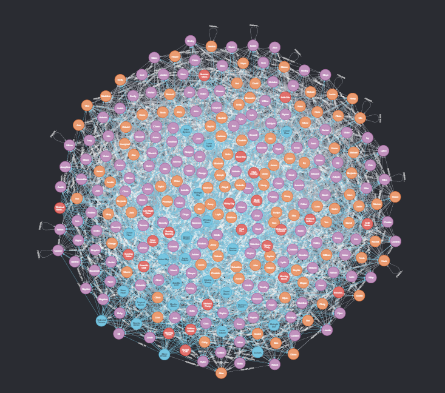

# **1. Introduction**

## The idea of graph databases

### Embracing the power of relationships:

> "Data is the new oil"

This expressive term implicates the importance of exploiting the value of data in our real world. For a piece of data to be valuable, it can not be isolated but connective with others.

To be clear, in the business scenario, to analyse customer behaviours, it is particularly useful to consider the relationship between customers and different types of products they purchased.

### Relational Data Model Being Ineffective with complex relationships:

Relationships exist in relational databases via means of joining tables supported by foreign keys and other constraints, which are _expensive_ and may add unnecessary metadata to DBMS.

The nature of relational databases make its connected entities sparse columns across databases making its complex and difficult to recognize the connection between data as data grows complex.

---

> **PROBLEM:**
> FIND PEOPLE (NOT YET FRIENDS) WITH SIMILAR MUSIC TASTE BASED ON PLAYLIST OVERLAPS

```sql
  SELECT
      p1.name AS person,
      p2.name AS recommendation,
      COUNT(DISTINCT pl1.playlist_id) AS shared_playlist_count,
      COUNT(DISTINCT sl1.song_id) AS shared_song_count,
      COUNT(DISTINCT pl1.playlist_id) + COUNT(DISTINCT sl1.song_id) AS total_count
  FROM Person p1
  JOIN Person p2
  JOIN rdbms.Playlist_Like pl1 ON p1.id = pl1.person_id
  JOIN rdbms.Playlist_Like pl2 ON p2.id = pl2.person_id
  JOIN rdbms.Song_Like sl1 on p1.id = sl1.person_id
  JOIN rdbms.Song_Like sl2 on p2.id = sl2.person_id
  WHERE NOT EXISTS (
      SELECT *
      FROM Friendship
      WHERE person1_id = p1.id
      AND person2_id = p2.id
  )
  AND p1.id = 1 -- me : Change id for each user
  AND pl1.playlist_id = pl2.playlist_id
  AND sl1.song_id = sl2.song_id
  AND p1.id <> p2.id
  GROUP BY p2.id, recommendation
  ORDER BY total_count DESC;
```

### NoSQL Fails to support relationships in data:

NoSQL databases _(key-value, document, column-oriented)_ store sets of disconnected documents/values/columns. The nature of NoSQL makes connecting entities difficult, usually resort to implementing "foreign-key-like attribubte" which is still not intuitive and resource-expensive.

## Data Model Comparison





# **2. Core Concepts of Graph Databases**

## What is a graph database?

A database that uses graph structures (nodes, edges/relationships) to represent and store data. Each node represents an entity, and each edge represents a relationship between entities.

**Two core components of a graph database:**

1. The underlying storage
2. The processing engine (native graph processing uses index-free adjacency)

## Core concepts within graph databases

- _Nodes_: Entities like users, songs, artists.
- _Relationships_: Directed, labeled connections (e.g., `LIKES`, `FOLLOWS`).
- _Properties_: Key-value pairs on nodes and relationships.

## Current popular graph databases

1. Neo4J
2. ArangoDB
3. DGraph
4. MemGraph
5. OrientDB

---

# **3. Applications of Graph Databases**

- **Social networks**: User connections, feed generation
- **Fraud detection**: Uncover hidden relationships between entities
- **Recommendation systems**: Based on likes, follows, shared behaviors
- **Graph AI / Knowledge Graphs**: Google Knowledge Graph, drug discovery, legal research

---

# **4. Strengths and Limitations**

- **Advantages**:

  - Natural modeling of complex relationships
  - High performance on deeply connected queries
  - Schema flexibility

- **Limitations**:

  - Not optimal for tabular/transactional data
  - Learning curve (e.g., Cypher)
  - Less mature ecosystem than SQL-based DBs
  - Write scalability can be challenging in distributed setups

---
